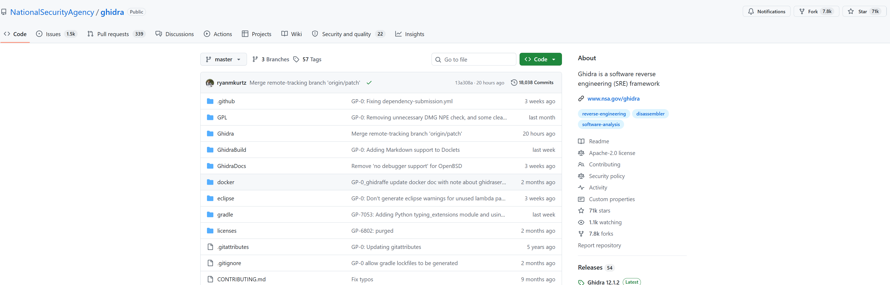
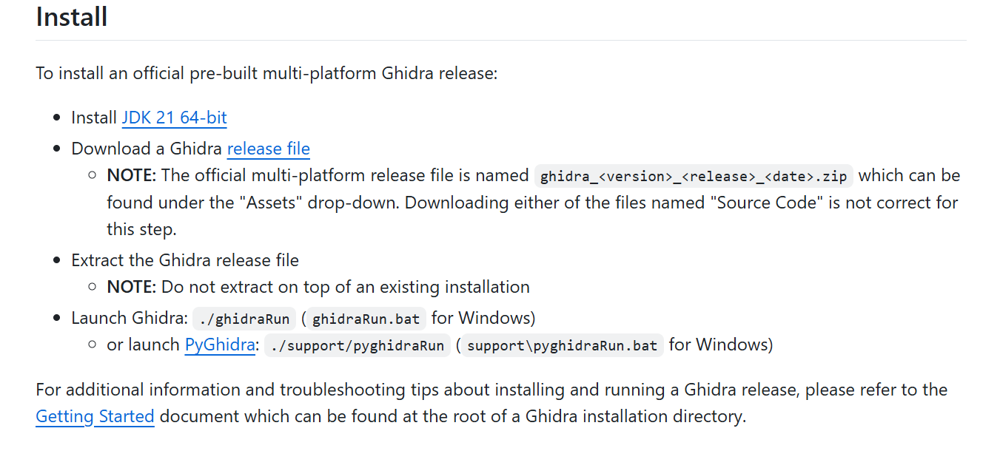
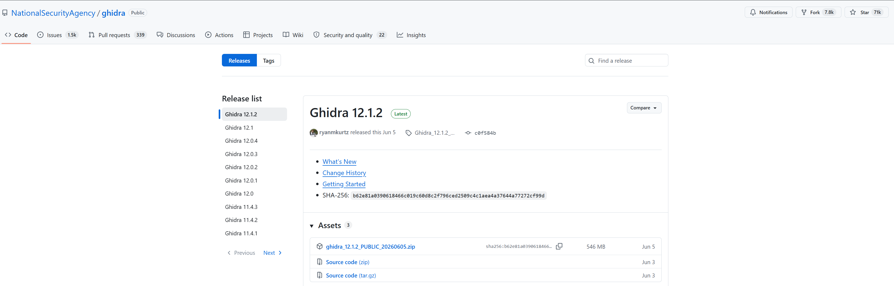
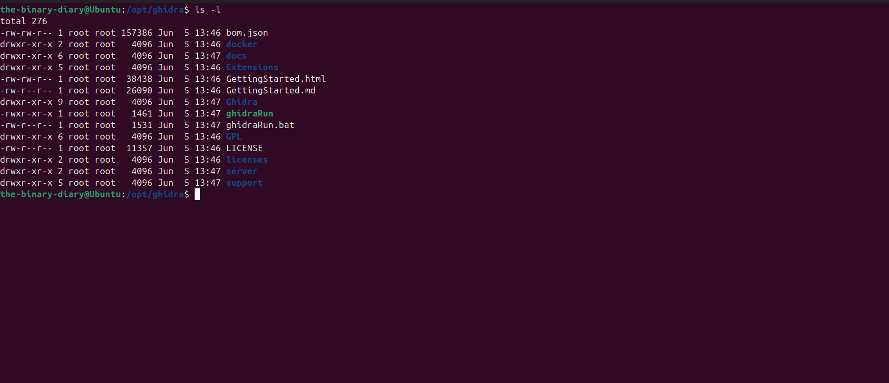
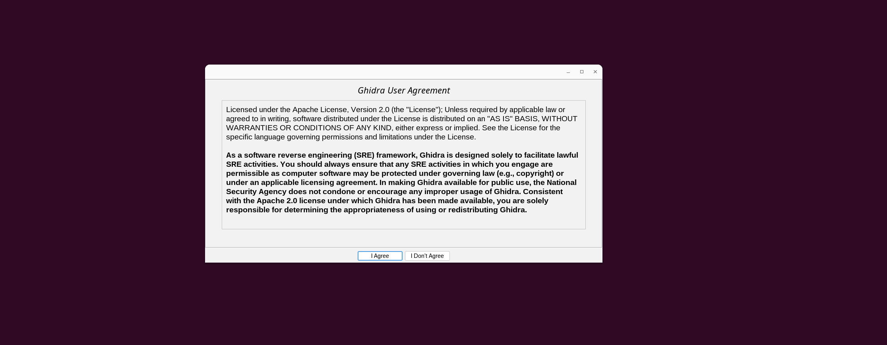

> **In this article,**
>
> We'll learn what Ghidra is, how to install it on Linux, and how to configure it for easier launching.

You are probably a beginner reverse engineer who has just started your journey and wants to learn your first tool, a CTF player who wants to tackle binary and reverse engineering challenges, or a reverse engineer who wants to get familiar with another reverse engineering platform besides IDA Pro or Binja, or perhaps someone else entirely. Whoever you are, you have come to the right place.

In this collection of Ghidra blog series, I am going to provide you with the essential information to master the versatile reverse engineering framework Ghidra. So buckle up, and let us get started.

<AlertBox variant="note" title="Note:">
This collection of blog series is designed to be self-contained, so you don't need any additional resources to follow along. However, if you'd like a more comprehensive reference, I highly recommend **The Ghidra Book: The Definitive Guide by Chris Eagle and Kara Nance**.
</AlertBox>

<!-- truncate -->

## First things first, what is Ghidra?

Developed by the National Security Agency (NSA), Ghidra is a fully-fledged Software Reverse Engineering (SRE) platform and is arguably the freely available open source competitor to IDA Pro. Among the many tools it contains, its interactive disassembler and decompiler make it stand out as an important static analysis tool. Furthermore, its extensibility, such as its ability to allow developers to write their own scripts, enables them to enhance its ecosystem, making the reverse engineering process more efficient.

Now that we have got a brief introduction to Ghidra, we can move on and install it on our machine. And by the way, if you are wondering how to pronounce its name, it is pronounced _Gee-dra_ with a hard **G**.

## Installing Ghidra

<AlertBox variant="info" title="Info:">
Before delving into the installation process of Ghidra, it is worth mentioning that if you are already using or planning to use REMnux or FLARE-VM, Ghidra comes preinstalled in both of these distributions.
</AlertBox>

To install Ghidra on Ubunto (the Linux distribution I prefer to use), navigate to the official [Ghidra Github repository](https://github.com/NationalSecurityAgency/ghidra). You will be greeted with the following page:



If you scroll down to the **Install** section, you will see the following:



Now navigate to the [releases page](https://github.com/NationalSecurityAgency/ghidra/releases) and download the latest release by clicking on the ZIP file. You can choose whichever release you want, since Ghidra's core functionality remains the same; only some features may differ between releases.



At this point, we have the Ghidra archive sitting in our **Downloads** directory. We need to move it somewhere we can keep its files while keeping our system organized. By convention, the best place for this is the `/opt` directory. Open your terminal and type the following:

```
sudo mv ghidra_12.1.2_PUBLIC_20260605.zip /opt
```

Having moved it there, we now `unzip` it and create a symbolic link to the folder using a name of our choice. Here, I prefer to use `ghidra` because it is easier to remember and type. You could simply rename the directory using the `mv` command, but I prefer to leave the original directory name untouched and create a symbolic link instead. Follow the steps below:

```
cd /opt
sudo unzip ghidra_12.1.2_PUBLIC_20260605.zip
sudo ln -s /opt/ghidra_12.1.2_PUBLIC /opt/ghidra 
```

Now let us have a peek into Ghidra's directory layout. After `cd`ing into the directory, we have the following layout:



Understanding the files and directories here will come in handy later, but for now, let us focus only on the launcher file called `ghidraRun`, highlighted in green. The problem is that this file is located in `/opt/`, which is not in the `$PATH` environment variable by default. That means every time we want to launch Ghidra, we need to type in the full path: `/opt/ghidra/ghidraRun`.

The best solution is to create a symbolic link in a directory that already exists in `$PATH`, so we will use `/usr/local/bin`. Now run the following command:

```
sudo ln -s /opt/ghidra/ghidraRun /usr/local/bin/ghidra
```

<AlertBox variant="tip" title="Tip:">
By convention, it is recommended to use `/usr/local/bin/` because it is specifically intended for executables that the local system administrator installs manually.
</AlertBox>

Now, from anywhere on your system, just type in:

```
ghidra
```

You will be greeted by the **Ghidra User Agreement**, as shown in the following screenshot:



Just click **I Agree**, and now you are ready to embark on your fun Ghidra journey.

<AlertBox variant="info" title="Info:">
When launching Ghidra for the first time, you might run into the following error:
> ERROR: The 'java' command could not be found in your PATH or with JAVA_HOME.
Please refer to the Getting Started document's Troubleshooting section.

Since Ghidra is primarily written in Java, it needs a Java Runtime Environment (JRE). This error simply means that Ghidra tried to launch Java but couldn't find a JRE. This problem could stem from three common causes: either Java is not installed, or Java is installed but not in `$PATH`, or the `JAVA_HOME` environment variable is incorrect.

So, if you don't have Java installed, just Google it! 😄
</AlertBox>

## Closing Comments

Ghidra is a powerful tool to have in your reverse engineering arsenal or for binary analysis in general. Hopefully, this article has provided you with a brief introduction to Ghidra and guided you through the installation process.