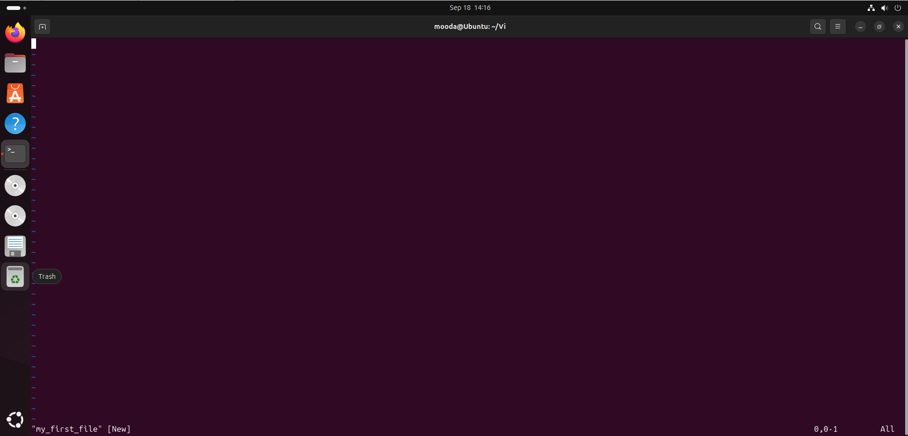
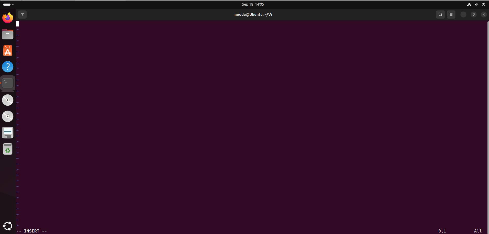
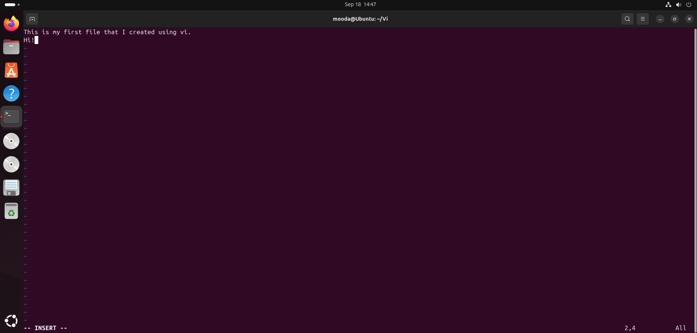

---

<Intro>
## In This Article

In the last post, we covered the essential information we need to know about vi. I've got to admit, it was not that juicy, but it needed to be done. In this article, we are going to take a step further and create our first file using vi. Then, we'll have a look around vi's interface and, most importantly, learn to *escape* vi and save our file. Now, let's get down to business!
</Intro>

<!-- truncate -->

## Opening a File
To open a file, we simply type the following command into the terminal:

<Terminal wrap={true}>
vi [FILE_NAME]
</Terminal>

The `vi` part of the command invokes vi, while the latter part specifies the filename to be opened. If the specified filename belongs to an existing file, vi will open that file for us. If it does not exist, vi will instead open a new buffer under that name, which we can later save to create the file.

<AlertBox variant="info" title="What is with the brackets?">
Conventionally, when a part of a command is optional, we denote it with `[]` or `<>`. I prefer the square-bracket style, and I will stick to that throughout this series.
</AlertBox>

Since the filename is an optional argument to vi, what would happen if we were to omit it? Well, opening vi without this argument will open an empty buffer that we can later save to a file and give a name to. For now, do not venture there; I just felt the need to mention it here.

## Interface of Vi

As soon as we fire up vi with a file, we are presented with vi's interface:

We see a bunch of tildes `~`, the name of the file we have just opened, and a bunch of other numbers. So let us begin to make sense of every component on the screen. The tildes going down the page on the left-hand side indicate empty lines containing no text, not even blank spaces. This is where we will be writing and editing our text. At the very bottom of the screen, we see what is called the status line. In this area, relevant information about the file, commands we type, and position information, such as which row (line) and column we are at, is presented. For example, in the above screenshot, we can see that the filename is being shown, which is vi's default behavior when you open a file and do not perform any other operation.

Now let us make our first change to the file by writing a sentence or a word. Remember, as I told you before, by default, we are in vi's **command mode**, and we have to explicitly tell vi that we want to insert a piece of text, which can be done by entering **insert mode** by pressing the `i` key. After pressing the `i` key, notice how the filename disappears, and in its place, vi now tells us that we are in the **-- INSERT --** mode.

Having entered insert mode, now we can type whatever we want. When we start writing, notice how the numbers at the bottom-right start changing on the status line. These numbers, separated by a comma, indicate the line we are currently on and the column we are currently at. If you keep writing on the same line, notice how the number after the comma starts to change. But when you hit Enter, notice how the former number starts to change. For example, I wrote two lines, and on the second line, I typed three characters, so the numbers show **2,4**: 2 because I am currently on line two, and 4 because, although I wrote three characters, my cursor is now at the 4th position waiting for me to type.

## Saving and Quitting a File
