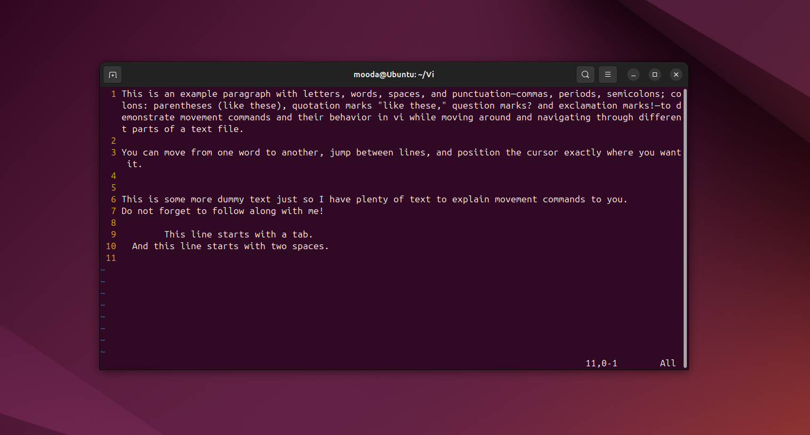
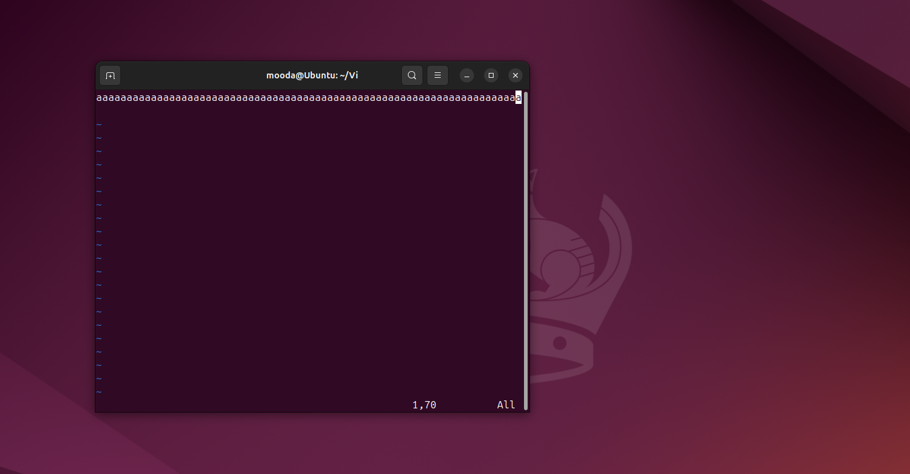

<Intro>
## Introduction

In the previous blog post, we got acquainted with vi's interface and learned some commands for saving files and quitting vi. Today's article will explain what a line is in vi and introduce new commands for simple movements in vi. Let's jump right in!
</Intro>

<!-- truncate -->

When we want to make edits in a file, we move the cursor to the position where we want to start editing. So we need to be able to do that as fast as possible. Fortunately for us, vi has commands that let us do that without even needing to take our hands off the keyboard.

## What Is a Line?

Before delving into the ways vi allows us to move the cursor around, we need to pay attention to some details, like what a line actually means in vi and how vi treats a line by default. So let us consider the following dummy text I wrote and explain things using it:

<AlertBox variant="tip" title="How to Make Line Numbers Visible in Vi?">
By default, vi's interface does not show line numbers. To make them visible, just run the command `:set nu`.
</AlertBox>

We have actual (logical) lines and visible (screen) lines. As you can see from the screenshot above, an actual line (indicated by the number preceding it) can span multiple visible lines and continues until we hit the `ENTER` key, while visible lines are the lines that are forced to wrap around to fit the screen size (those that do not have any numbers preceding them). So vi treats any written text as a single line until it encounters a newline character, which is inserted by us when we press `ENTER`.

As a matter of fact, we can change this behavior. For this, let us do an experiment together.

Let's create a file called experiment by running the command `vi experiment`.

Now, press `i` to enter insert mode. Press the `a` key until you see the column number indicator show 71 (there are 70 `a`s, and the 71st column is where your cursor is right now). Then, hit `ENTER`, and after that, press `ESC` to exit insert mode and make sure you do not accidentally type any further text.

Now press `BACKSPACE` to go to the end of the previous line. You are now at the last `a`, which is at the 70th column. Finally, resize your vi (terminal) window so that the right edge is at the 70th column and no white space is left:

Right now, the column indicator shows 70, right? Well, we did this just to establish a certain column and window width. Now, let the fun begin.

Type this command: `:set wm=30`. What this command does is override the default setting so that, while entering text, vi automatically inserts a newline when the text gets within 30 columns of the right edge of the vi window as soon as it encounters whitespace.

What that means in our example is that we have a 70-column-wide window and have told vi to leave a wrap margin of 30 columns. That gives us 40 columns before reaching that margin. Now, as we continue entering text past that point, vi will wrap the text at whitespace by automatically inserting a newline.

Give it a try now and insert exactly 40 `b`s. Note that after typing 40 `b`s, your cursor is now at the 41st column. Nothing happened, right? Well, now press `SPACE` and type another `b`, and voila! You are on a completely new line.

This behavior kicks in only when vi encounters whitespace. So, if you set `wm=30` but keep entering 200 characters without any whitespace, vi will not automatically break the text into a new line.

Now that we have established what a line is in vi and how we can override the default line-breaking behavior, we can discuss the cursor movement commands.

## Cursor Movement Commands

Vi has several commands for cursor movement. In this article, we'll focus on the basic ones: commands that allow us to move within the same line to the left or right and commands that let us move one line up or down.

### Moving within the Current Line

The commands for performing movements within the current line are as follows:

* `h` or the arrow key `←`: moves the cursor one space to the left.
* `l` or the arrow key `→`: moves the cursor one space to the right.
* `0`: moves the cursor to the beginning of the line, regardless of whether it begins with blanks or tabs.
* `$`: moves the cursor to the end of the line.
* `^`: moves the cursor to the first non-blank character of the line.
* `n|`: moves the cursor to the nth column of the line.

It is worth mentioning here that moving the cursor to the right past the end of the line will not wrap it around to the beginning of the next line, nor will moving the cursor to the left past the beginning of the line wrap it around to the end of the previous line.

### Moving between Lines

The commands for moving between lines, whether one line up or one line down, are as follows:

* `ENTER` or `+`: moves the cursor to the first non-blank character of the next line.
* `-`: moves the cursor to the first non-blank character of the previous line.

* `k` or the arrow key `↑`: moves the cursor one line up while attempting to maintain the same cursor position.
* `j` or the arrow key `↓`: moves the cursor one line down while attempting to maintain the same cursor position.

### Hybrid Line Movement

While there is no such category, I would like to put the `BACKSPACE` key under this category. `BACKSPACE` moves the cursor back one character at a time when moving along the current line, but unlike `h` or the `←` key, it allows wrapping around to the end of the previous line.

## Practice Time

Now that you have learned the concepts and commands, do not stop here. The best way to retain information and grasp concepts is to practice. So take on this simple exercise and reinforce what you have just learned. Get your hands dirty!

Run `vi experiment`, enter insert mode by pressing `i`, and paste the following text block into it:

<Snippet
  filename="Experiment"
  source="./files/experiment.txt"
  defaultOpen={true}
/>

Now, press `ESC` to enter command mode and run `:set nu` to make line numbers visible so you can easily follow my instructions.

At this moment, we are at the end of the file because we pasted the text we copied. So hit the key `-` several times so that the cursor is now positioned at the beginning of line 1 at the `T`. Press `$`. Where is the cursor right now?

<Snippet
  filename="Answer 1"
  source="./files/answer_1.txt"
  defaultOpen={false}
/>

At this point, I want you to return to the beginning of the line (exactly at the `T`). Which command should we use for this purpose?

<Snippet
  filename="Answer 2"
  source="./files/answer_2.txt"
  defaultOpen={false}
/>

Now, let us go to line 3 by hitting `ENTER` two times. How do we move to the `e` in `move`?

<Snippet
  filename="Answer 3"
  source="./files/answer_3.txt"
  defaultOpen={false}
/>

Now press `$`, and then hit the arrow key `↓` seven times. Where are you now?

<Snippet
  filename="Answer 4"
  source="./files/answer_4.txt"
  defaultOpen={false}
/>

Now press `^`. Where are you right now? Where would the cursor be if you pressed `0`?

<Snippet
  filename="Answer 5"
  source="./files/answer_5.txt"
  defaultOpen={false}
/>

## Closing Comments

Vi provides a plethora of commands for moving around, from basic ones to more advanced ones. Throughout this article, we have discussed basic commands for cursor movement and practiced them with a small quiz. I hope you followed along with me and got all your answers right. Do not forget to add the commands you have just learned to your cheat sheet. Until next time, when we'll learn some more advanced movement commands, keep experimenting!
